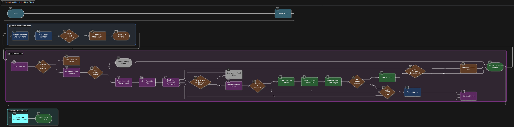

# Jane The Ripper 

**Jane The Ripper** is an interactive program where users can test out password cracking 

---

## Features  
- A functional password cracker 
- Simple, text-based interface  
- Educational tool for learning(And NOT used for bad intentions!!)

---

## Installation  

1. Clone the repository:  
   ```bash
   git clone https://github.com/WTCSC/jane-the-ripper-Eclipse0-Gum.git
   cd jane-the-ripper-Eclipse0-Gum


## Flowchart 

A flow chart of the process:

